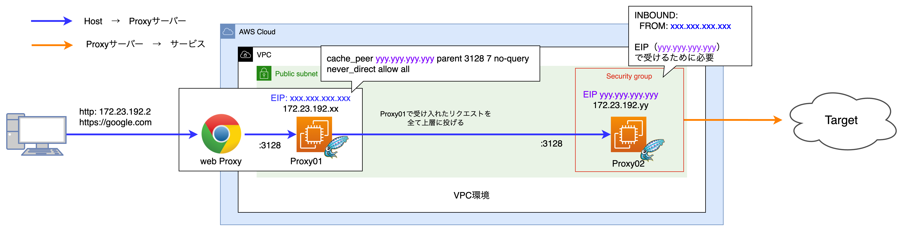

# 多段XFFアクセス環境の構築方法

# 背景
フォワードプロキシサーバー構築の練習。  
プロキシ環境は [Squid](http://www.squid-cache.org/) を利用する。

# 構築する環境
今回構築する環境は以下


1. ホストマシンから一段目のProxyサーバー（以降Proxy01）越しに目的のエンドポイントへアクセス
2. Proxy01から二段目のProxyサーバー（以降Proxy02）へリクエストがリダイレクト
3. 経由してきたサーバーのIPがx-forwarded-forに埋まった状態で目的のエンドポイントにProxy02からリクエストが飛ぶ

# 事前準備

新規で環境を作成するにあたり、以下のリソースが用意されていることが前提。

| 準備対象 | 設定名称 | 設定値 | 説明 |
| --- | --- | --- | --- |
| EIP01 | XFF-ProxyServer-IP-01 | 自動生成（xxx.xxx.xxx.xxxで表現） | Proxyサーバー01用のEIP |
| EIP02 | XFF-ProxyServer-IP-02 | 自動生成（yyy.yyy.yyy.yyyで表現） | Proxyサーバー02用のEIP |
| セキュリティグループ | Proxy-Sg | Source:  EIP01の値: (xxx.xxx.xxx.xxx) <br>  Port: 3128 | Proxyサーバー01からのアクセスを許可したセキュリティグループ。<br>  今回は xxx.xxx.xxx.xxx/32 |

# 新規多段XFF環境の作成

## プロキシサーバー用のインスタンス作成

今回多段XFFをする都合で2台インスタンスを用意する必要がある。  
インスタンス設定に差はないので、以下の条件でEC2インスタンスを2台作成する。

| パラメータ | 設定値 | 補足 |
| --- | --- | --- |
| AMI | 最新のAmazonLinux | 特にこだわりはないので最新の |
| インスタンスタイプ | t3a.micro | 簡単な処理だけなので安ければなんでもOK |
| キーペア | xxx | sshできる任意のキーペア <br> (ここでは proxy-key) |
| VPC | vpc-xxx | AWS環境のVPC |
| サブネット | public-subnet-a | EC2を動かすパブリックサブネット |
| パブリックIPの自動割り当て | 無効化 | EIPを付与するので不要 |
| ファイアウォール <br> (セキュリティグループ) | default  <br>  proxy <br>  access  | default <br> Proxy用 <br> ホストマシンからのアクセス用 |

その後、各Proxyサーバーに以下のEIPを割り当てる。

| 対象サーバー | 設定するEIP | EIP（今回の環境の場合） |
| --- | --- | --- |
| Proxy01 | XFF-ProxyServer-IP-01 | xxx.xxx.xxx.xxx |
| Proxy02 | XFF-ProxyServer-IP-02 | yyy.yyy.yyy.yyy |

これ以降、作成したインスタンスそれぞれにsshして環境を構築する。

## Proxy01環境作成

Proxy01(ホストマシンからアクセスするサーバー) を作成する。

まずは設定したEIPに向けてsshしてログインし必要なコマンドを入れていく。

```
# 設定したEIPでssh
~  ssh -i ~/.ssh/proxy-key.pem ec2-user@xxx.xxx.xxx.xxx

# 以降の処理で楽するためsudoユーザーになっておく
[ec2-user@ip-172-23-192-xx ~]$ sudo -s

# yumを更新してsquidをインストール
[root@ip-172-23-192-xx ec2-user]# yum upgrade
[root@ip-172-23-192-xx ec2-user]# yum install squid

# 念の為デフォルト設定は/etc/squid/old/配下に保持しておく
[root@ip-172-23-192-xx ec2-user]# mkdir /etc/squid/old
[root@ip-172-23-192-xx ec2-user]# mv /etc/squid/squid.conf /etc/squid/old/

# squidの設定を入れる（後述）
[root@ip-172-23-192-xx ec2-user]# vim /etc/squid/squid.comf
```

Proxy01の設定は以下。

```yaml
# IPアドレス定義
acl localnet src 10.0.0.0/8	# RFC1918 possible internal network
acl localnet src 192.168.0.0/16 # RFC1918 possible internal network
acl localhost src 127.0.0.1/32

# squid02へ転送
# yyy.yyy.yyy.yyyはProxy02のEIP
cache_peer yyy.yyy.yyy.yyy parent 3128 7 no-query
never_direct allow all

# 自身からのアクセスはすべて許可する
http_access allow localhost

# 接続元はSGで接続が絞られていることを想定するため全公開
acl all src 0.0.0.0/0
http_access allow all

# x-forwarded-for設定
forwarded_for on

# ポート80、443以外のHTTP通信を拒否する
acl Safe_ports port 80		# http
acl Safe_ports port 443		# https
http_access deny !Safe_ports

# SSLの場合、ポート443以外のHTTP通信を拒否する
acl SSL_ports port 443		# https
acl CONNECT method CONNECT
http_access deny CONNECT !SSL_ports

# これまで定義した以外のアクセスはすべて拒否する
http_access deny all

# デフォルトのSquid使用ポート
http_port 3128

# キャッシュを用いない
no_cache deny all

# コアファイルの格納する場所
coredump_dir /var/spool/squid

# access.logのフォーマット
logformat squid-host %{X-Forwarded-For}>h (%>a) %ui %un [%tl] "%rm %ru HTTP/%rv" %>Hs %<st "%{Referer}>h" "%{User-Agent}>h" %Ss:%Sh
access_log daemon:/var/log/squid/access.log squid-host

```

設定ができたらsystemctlにサービスを登録して永続化。

```
# サービスとして起動
[root@ip-172-23-192-xx ec2-user]# systemctl start squid.service
# 永続化
[root@ip-172-23-192-xx ec2-user]# systemctl enable squid.service
# 念の為statusチェック
[root@ip-172-23-192-xx ec2-user]# systemctl status squid.service

```

## Proxy02環境作成

Proxy02(Proxy01からアクセスされXFFを埋めてプロキシするサーバー) を設定。  
こちらも基本的にはProxy01と同様の設定。

```
# 設定したEIPでssh
~  ssh -i ~/.ssh/proxy-key.pem ec2-user@yyy.yyy.yyy.yyy

# 以降の処理で楽するためsudoユーザーになっておく
[ec2-user@ip-172-23-192-yy ~]$ sudo -s

# yumを更新してsquidをインストール
[root@ip-172-23-192-yy ec2-user]# yum upgrade
[root@ip-172-23-192-yy ec2-user]# yum install squid

# 念の為デフォルト設定は/etc/squid/old/配下に保持しておく
[root@ip-172-23-192-yy ec2-user]# mkdir /etc/squid/old
[root@ip-172-23-192-yy ec2-user]# mv /etc/squid/squid.conf /etc/squid/old/

# squidの設定を入れる（後述）
[root@ip-172-23-192-yy ec2-user]# vim /etc/squid/squid.comf

```

Proxy02ではProxy01からのリクエストを受け取る前提の設定を入れる。

```yaml
# IPアドレス定義
acl localhost src 127.0.0.1/32
acl proxy01   src xxx.xxx.xxx.xxx/32

# 自身からのアクセスはすべて許可する
http_access allow localhost

# 許可される接続元のIPアドレス(squid01)
http_access allow proxy01
http_access deny !proxy01

# 接続元はSGで接続が絞られていることを想定するため全公開
acl all src 0.0.0.0/0
http_access allow all

# x-forwarded-for設定
forwarded_for on

# ポート80、443以外のHTTP通信を拒否する
acl Safe_ports port 80		# http
acl Safe_ports port 443		# https
http_access deny !Safe_ports

# SSLの場合、ポート443以外のHTTP通信を拒否する
acl SSL_ports port 443		# https
acl CONNECT method CONNECT
http_access deny CONNECT !SSL_ports

# ホワイトリストで定義したURLへのアクセスを許可する
acl whitelist dstdomain "/etc/squid/whitelist"
http_access allow whitelist

# これまで定義した以外のアクセスはすべて拒否する
http_access deny all

# デフォルトのSquid使用ポート
http_port 3128

# キャッシュを用いない
no_cache deny all

# コアファイルの格納する場所
coredump_dir /var/spool/squid

# access.logのフォーマット
logformat squid-host %{X-Forwarded-For}>h (%>a) %ui %un [%tl] "%rm %ru HTTP/%rv" %>Hs %<st "%{Referer}>h" "%{User-Agent}>h" %Ss:%Sh
access_log daemon:/var/log/squid/access.log squid-host

```

設定ができたらProxy01と同様にsystemctlにサービスを登録して永続化。

```
# サービスとして起動
[root@ip-172-23-192-yy ec2-user]# systemctl start squid.service
# 永続化
[root@ip-172-23-192-yy ec2-user]# systemctl enable squid.service
# 念の為statusチェック
[root@ip-172-23-192-yy ec2-user]# systemctl status squid.service

```

# 多段プロキシでのリクエスト

## curlで確認

環境が構築し終わったら `-x` オプションを入れ curlを実行。
（とりあえずターゲットは[example.com](https://example.com/)）

```bash
 ~  curl <https://example.com> -x xxx.xxx.xxx.xxx:3128 -v
 *   Trying xxx.xxx.xxx.xxx:3128...
* Connected to xxx.xxx.xxx.xxx (xxx.xxx.xxx.xxx) port 3128 (#0)
* CONNECT tunnel: HTTP/1.1 negotiated
* allocate connect buffer
* Establish HTTP proxy tunnel to example.com:443
> CONNECT example.com:443 HTTP/1.1
> Host: example.com:443
# 中略
< HTTP/2 200
< age: 499689
< cache-control: max-age=604800
< content-type: text/html; charset=UTF-8
< date: Tue, 22 Aug 2023 09:16:38 GMT
< etag: "3147526947+ident"
< expires: Tue, 29 Aug 2023 09:16:38 GMT
< last-modified: Thu, 17 Oct 2019 07:18:26 GMT
< server: ECS (sec/96EE)
< vary: Accept-Encoding
< x-cache: HIT
< content-length: 1256
<
<!doctype html>
<html>
<head>
    <title>Example Domain</title>
# 中略
<div>
    <h1>Example Domain</h1>
    <p>This domain is for use in illustrative examples in documents. You may use this
    domain in literature without prior coordination or asking for permission.</p>
    <p><a href="<https://www.iana.org/domains/example>">More information...</a></p>
</div>
</body>
</html>
* Connection #0 to host xxx.xxx.xxx.xxx left intact

```

リクエストが届いた場合は設定が完了しているはず。  
なので、実際のリクエスト情報をそれぞれのサーバーのアクセスログから確認する。

各サーバーの `/var/log/squid/access.log` にリクエストの詳細が出力され、Proxy01がProxy02にリクエストが投げられ、Proxy02ではXFFにホストとProxy01のIPがx-forwarded-forに格納されているはず。

```bash
# Proxy01
[root@ip-172-23-192-xx ec2-user]# tail -f /var/log/squid/access.log
- (<自宅IP>) - - [22/Aug/2023:09:16:38 +0000] "CONNECT example.com:443 HTTP/1.1" 200 5975 "-" "curl/8.1.2" TCP_TUNNEL:FIRSTUP_PARENT

# Proxy02
[root@ip-172-23-192-yy ec2-user]# tail -f /var/log/squid/access.log
<自宅IP> (xxx.xxx.xxx.xxx) - - [22/Aug/2023:09:16:38 +0000] "CONNECT example.com:443 HTTP/1.1" 200 5975 "-" "curl/8.1.2" TCP_TUNNEL:HIER_DIRECT

```

Proxy02からリクエストを受けたエンドポイントでは、以下のように2つのProxyサーバーのIPがXFFに格納されたリクエストが届くようになる。

以下の例では、`forwardedfor`に `<自宅IP>`, `xxx.xxx.xxx.xxx(Proxy01のEIP)` が入り、リクエストホストとして`yyy.yyy.yyy.yyy(Proxy02のEIP)` が記録される。

```bash
[ec2-user@ip-172-23-192-37 ~]$ sudo tail -f /var/log/nginx/access.log
local_time:23/Aug/2023:05:11:18 +0000	host:yyy.yyy.yyy.yyy	forwardedfor:<自宅IP>, xxx.xxx.xxx.xxx	req:GET / HTTP/1.1	status:304	size:0	referer:-	ua:Mozilla/5.0 (Macintosh; Intel Mac OS X 10_15_7) AppleWebKit/537.36 (KHTML, like Gecko) Chrome/115.0.0.0 Safari/537.36	reqtime:0.000	cache:-	runtime:-	vhost:3.112.232.50	method:GET	uri:/
```

## ホストマシンにプロキシ設定を入れる
macの場合は `システム設定` > `Wi-Fi` > `プロキシ設定` > `保護されたWebプロキシ（HTTPS）` にて以下の設定を入れる。

| 設定項目 | 設定値 | 補足 |
| --- | --- | --- |
| サーバ | EIP01のIP | 今回の環境では xxx.xxx.xxx.xxx |
| ポート | 3128 | Squidのデフォルトポート
（プロキシサーバーの標準的な設定値） |

この状態でGlobal IPをチェックするとProxy02のIPに書き換わっている。
FYI: https://www.cman.jp/network/support/go_access.cgi
